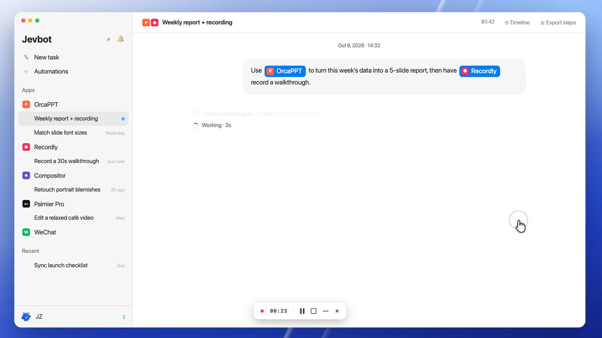
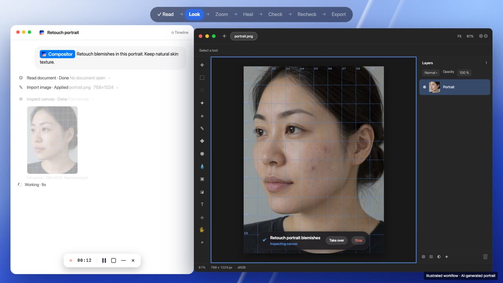

# Jevbot

[English](README.md) | [简体中文](README_ZH.md)

**Tell your Mac apps what you want to get done.**

[Download](https://github.com/jevbot-dev/jevbot-mac/releases) · [Follow updates](https://x.com/jevbot_dev)

**[Watch the overview →](https://x.com/jevbot_dev/status/2108195380479570204)** · 46s

## See it in action

<table>
  <tr>
    <td width="50%" valign="top">
      
      
<strong><a href="https://x.com/jevbot_dev/status/2108150994353946732">Retouch a portrait →</a></strong> Find blemishes, check each edit, and approve the export.

    </td>
    <td width="50%" valign="top">
      
      
<strong><a href="https://x.com/jevbot_dev">Follow phone demo updates →</a></strong> Review similar photos, choose what to keep, and revisit trips on a map. Video coming to X.

    </td>
  </tr>
</table>

## Get started

**Apple Silicon Mac · macOS 14+**

1. Download an installer from [GitHub Releases](https://github.com/jevbot-dev/jevbot-mac/releases) and move Jevbot to Applications.
2. Configure an AI engine in Settings and connect the apps you want to use.
3. Grant Accessibility, Screen Recording, and other permissions when prompted.
4. Open the relevant apps and projects, create a task in Jevbot, and describe your goal.

## Connect

<table>
  <tr>
    <td align="center" valign="top" width="33%">
      
      
<a href="https://x.com/jevbot_dev"><strong>@jevbot_dev ↗</strong></a>

      
Product updates

    </td>
    <td align="center" valign="top" width="33%">
      
      
<strong>Contact on WeChat</strong>

      
Scan to add · Click to enlarge

    </td>
    <td align="center" valign="top" width="33%">
      
      
<strong>Join the community</strong>

      
Scan with WeChat or WeCom Valid until October 15, 2026 · <a href="https://jevbot.dev/">Latest QR code</a>

    </td>
  </tr>
</table>
