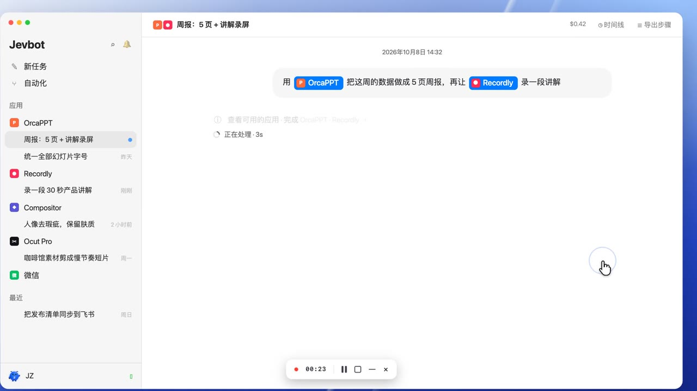
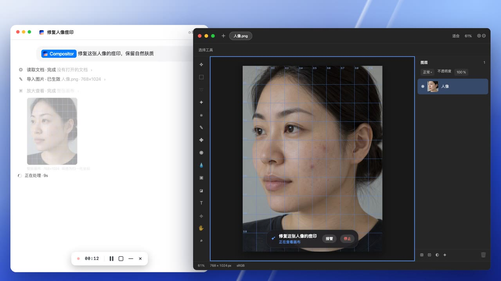
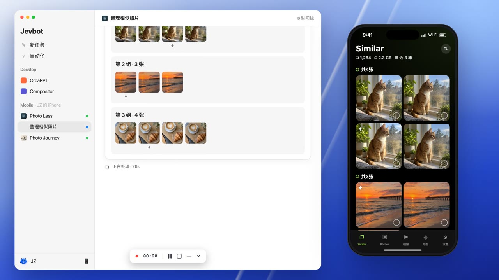

# Jevbot

[English](README.md) | [简体中文](README_ZH.md)

**一句话，让 Mac 上的应用帮你完成工作。**

[下载安装](https://github.com/jevbot-dev/jevbot-mac/releases) · [关注更新](https://x.com/jevbot_dev)

**[观看产品介绍 →](https://x.com/jevbot_dev/status/2108195380479570204)** · 46 秒

## 看看它能做什么

<table>
  <tr>
    <td width="50%" valign="top">
      
      
<strong><a href="https://x.com/jevbot_dev/status/2108150994353946732">一句话修人像 →</a></strong> 找瑕疵、逐步检查，导出由你批准。

    </td>
    <td width="50%" valign="top">
      
      
<strong><a href="https://x.com/jevbot_dev">关注手机演示更新 →</a></strong> 查看相似照片、标记保留，在地图上回顾旅程。视频待发布到 X。

    </td>
  </tr>
</table>

*以上为动画演示，产品介绍与修图封面链接到 X 视频帖子，手机封面链接到 X 主页以关注更新；可用操作取决于已连接的应用。*

## 开始使用

**Apple Silicon Mac · macOS 14+**

1. 从 [GitHub Releases](https://github.com/jevbot-dev/jevbot-mac/releases) 下载安装包，将 Jevbot 放入「应用程序」。
2. 在设置中配置 AI 引擎，连接需要操作的应用。
3. 按提示授予辅助功能、屏幕录制等权限。
4. 打开相关应用和项目，在 Jevbot 中新建任务，输入目标。

## 联系与交流

<table>
  <tr>
    <td align="center" valign="top" width="33%">
      
      
<a href="https://x.com/jevbot_dev"><strong>@jevbot_dev ↗</strong></a>

      
关注产品更新

    </td>
    <td align="center" valign="top" width="33%">
      
      
<strong>添加 Jevbot 微信</strong>

      
扫码添加 · 点击放大

    </td>
    <td align="center" valign="top" width="33%">
      
      
<strong>加入 Jevbot 交流群</strong>

      
使用微信或企业微信扫码加入 2026 年 10 月 15 日前有效 · <a href="https://jevbot.dev/">查看最新二维码</a>

    </td>
  </tr>
</table>
